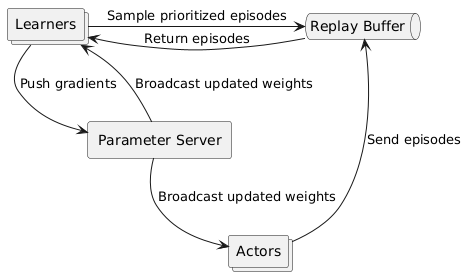

# MuZero

This project is a Python implementation of the [**MuZero**](https://arxiv.org/pdf/1911.08265) algorithm created by Google Deepmind, designed to be used with the OpenAI Gym environment. It is built to be modular and extensible, allowing for easy integration with different Gymnasium environments and neural network configurations.

<details>
<summary><b>📋 Table of contents </b></summary>

- [MuZero](#muzero)
  - [Overview](#overview)
  - [Prerequisites](#prerequisites)
  - [Usage](#usage)
  - [Testing](#testing)
  - [📖 Documentations](#-documentations)
  - [Contributors](#contributors)

</details>

Check out our presentation video below for an in-depth overview:

<video width="320" height="240" controls>
  <source src="https://drive.google.com/file/d/1IuC-k_D3HP1ETidpQR6LXNWoOgg99JGW/view?usp=sharing" type="video/mp4">
</video>


Our MuZero in action, demonstrating performance on the Car Racing game in OpenAI Gym:

<video width="320" height="240" controls>
  <source src="docs/images/car_racing_simulation_21.mp4" type="video/mp4">
</video>

## Overview
MuZero is an advanced **model-based** reinforcement learning algorithm that jointly learns **a dynamics model**, **a value function**, and **a policy** through self-play training. Unlike traditional systems like AlphaZero, MuZero does not require explicit knowledge of the true environment dynamics. Instead the model gets the last 32 frames as input and it learns its own abstract internal representation of the environment. This allows for using Monte Carlo Tree Search (MCTS) to plan ahead in latent space making it capable of sophisticated planning, resulting in superhuman performance across various complex environments.

As the model does not require the true environment dynamics, it can be applied to a much wider range of problems. This being very useful in real-world applications where the environment is almost never fully known or is too complex to model explicitly. However the lack of explicit environment model makes it much more difficult to train, as the model has to learn the dynamics of the environment from scratch and it will start of by scrambling the signals it receives from the environment.

We needed to improve the sampling efficiency of the model training on the data the model thinks is most surprising and what episodes that it did the best on. This is done by using a [**Prioritized Experience Replay**](https://arxiv.org/pdf/1511.05952) which allows the model to focus on the most important experiences and learn from them more effectively. The model is trained on a large number of episodes, and it learns to prioritize the most important experiences based on their impact on the learning process.



But as the model needs lots of training data we scaled the training process by using a [**Distributed Prioritized Experience Replay**](https://arxiv.org/pdf/1803.00933). Where we had several instances of the program continuously generating training data in parallel. Each instance of the program runs its own environment and collects experiences, which are then stored in a shared experience replay buffer. While we had a parameter server that manages the model parameters and synchronizes them across all instances. With a trainer that samples from the shared experience replay buffer and updates the model parameters based on the sampled experiences.


## Prerequisites
- Ensure that git is installed on your machine. [Download Git](https://git-scm.com/downloads)
- Docker is used for the backend and database setup. [Download Docker](https://www.docker.com/products/docker-desktop)


## Usage
To start, run the following command in the root directory of the project:
```bash
python main.py
```


## Testing

To run the tests, run the following command in the root directory of the project:
```bash
pytest
```

To run the tests with coverage, run the following command in the root directory of the project:
```bash
coverage run -m pytest
```

To see the coverage report, run the following command in the root directory of the project:
```bash
coverage html -i
```

## 📖 Documentations

- [Developer Setup Guild](docs/manuals/developer_setup.md)


## Contributors


<table align="center">
  <tr>
    <td align="center">
        <a href="https://github.com/Knolaisen">
            <br />
            <sub><b>Kristoffer Nohr Olaisen</b></sub>
        </a>
    </td>
    <td align="center">
        <a href="https://github.com/olavsl">
            <br />
            <sub><b>Olav Selnes Lorentzen</b></sub>
        </a>
    </td>
    <td align="center">
      <a href="https://github.com/sandviklee">
          <br />
          <sub><b>Simon Sandvik Lee</b></sub>
      </a>
    </td>
    <td align="center">
        <a href="https://github.com/SverreNystad">
            <br />
            <sub><b>Sverre Nystad</b></sub>
        </a>
    </td>
  </tr>
</table>
